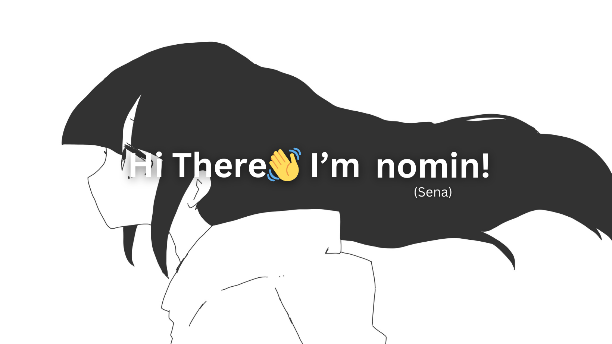

# Welcome to my profile!
## Badges

## WakaTime

## My Stats

## This page stats

<picture>
  <source media="(prefers-color-scheme: dark)" srcset="https://raw.githubusercontent.com/obregonia1/obregonia1/master/img/snake-dark.svg">
  <source media="(prefers-color-scheme: light)" srcset="https://raw.githubusercontent.com/obregonia1/obregonia1/master/img/snake.svg">
  
</picture>
